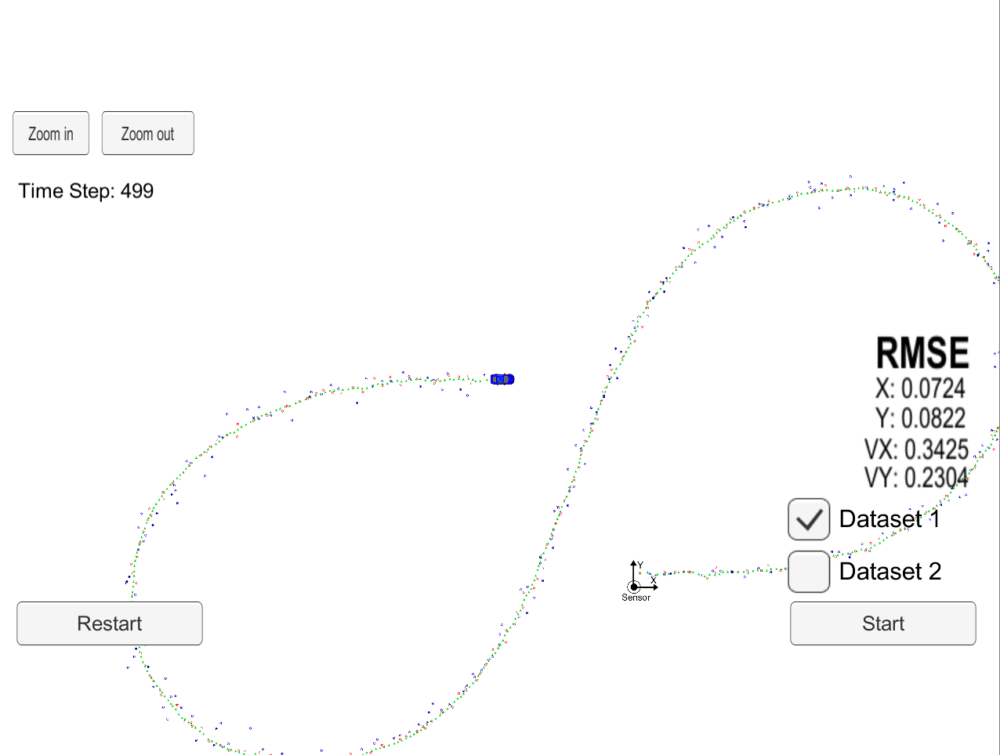
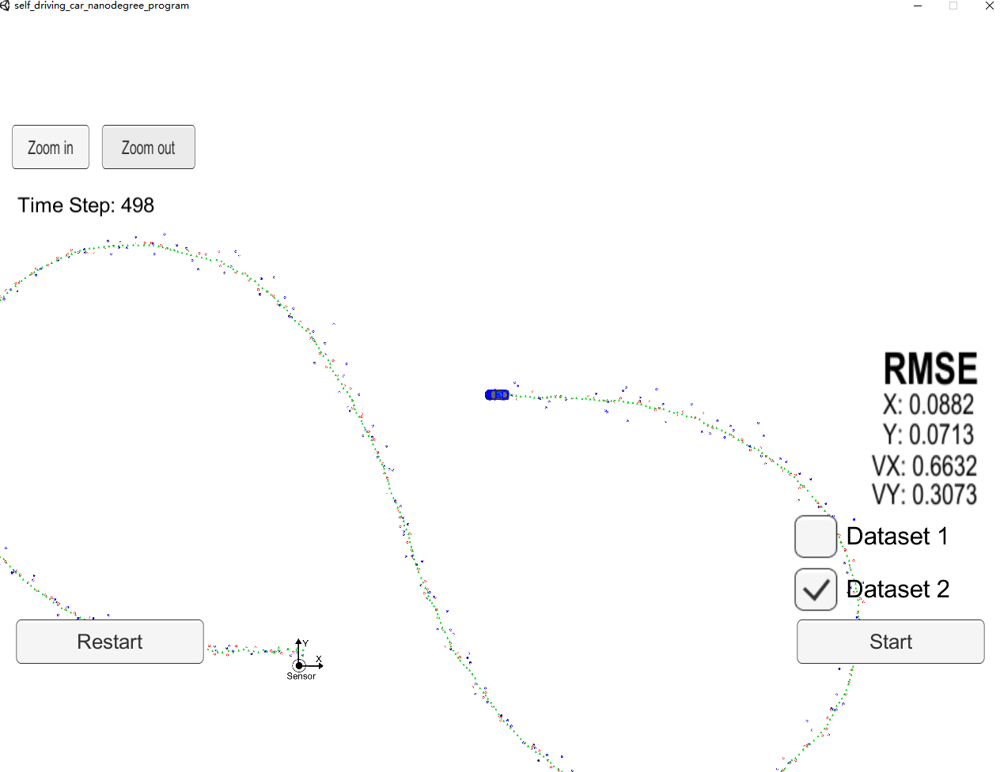

# CarND-Unscented-Kalman-Filter
Udacity Self-Driving Car Engineer Nanodegree Program, Term 2 ,Project 2 - Unscented Kalman Filter 

## Project Basics
This project is write by C++.

I used Unscented Kalman Filter  to predict and update the position based on lidar and radar data.

This project involves the Term 2 Simulator.

## Build instructions
I was build in Ubuntu 16.04:
1. Clone this repo.
2. Make a build directory: `mkdir build && cd build`
3. Compile: `cmake .. && make`
4. Run it: `./ExtendedKF`

## Results
There are two dataset.  
px:x-position  
py:y-position  
vx:velocity in the x-direction  
vy:velocity in the y-direction  
MSE:mean squared error  

The UKF accuracy was:  

Dataset 1 : RMSE = [0.0724, 0.0822, 0.3425, 0.2304]

Dataset 2 : RMSE = [0.0882, 0.0713, 0.6632, 0.3073]

*Test One*
 

*Test Two*

